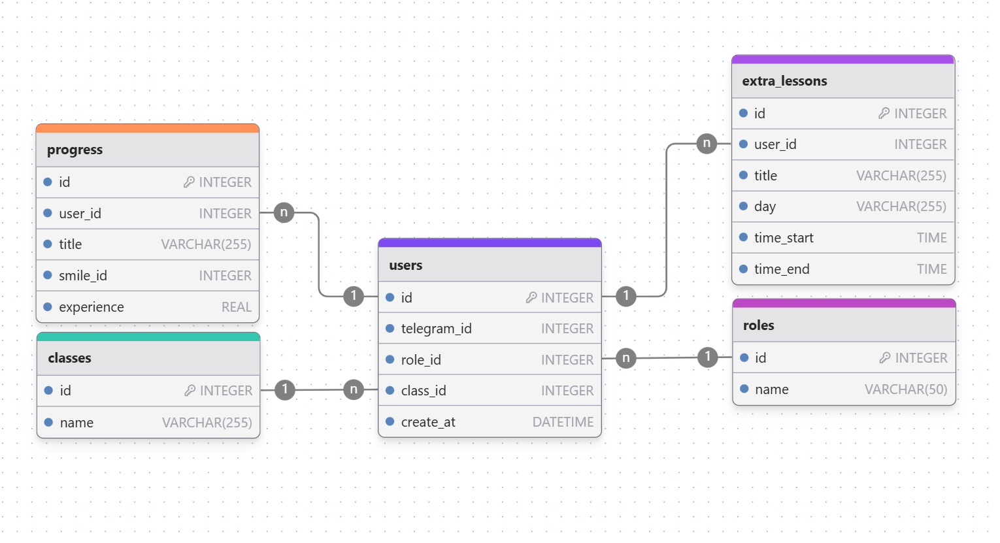

# School Telegram Bot

## База данных


## О конфигурации
Вся конфигурация хранится в `src/resources/application.py`.

О том, какие файлы понадобятся и ключи понадобятся для запуска:
  - Токен телеграмм бота поместите в переменное окружение с названием BOT_TOKEN
  - Добавьте файл `users_role.json` в папку `resources` в нём должен быть такой формат
    ``` 
        {
          "admins": [4333125645],
          "beta_testers": [5665545456],
          "teachers": {
            "132165478": ["5а", "6г", "10а"]
          }
        }
    ```
    айдишники админов, бета-тестеров и учителей (["5а", "6г", "10а"] - список классов, которыми учитель управляет).
    Переменные вынесены в отдельный файл, потому что предполагается раздача ролей и управление учителями
    напрямую через бота.
  - Если хотите, чтобы расписание подтягивалось из Google Sheets измените `IS_GOOGLE = True`, потом
    скопируйте ссылку на гугл диск [таблицу](https://docs.google.com/spreadsheets/d/10tHlL4Z_HsXdtDCiLJn2lElQew0aoh-W1J1dOpEKAwA/edit?usp=sharing).
    Создайте ключ от [google api](https://azzrael.ru/google-cloud-platform-create-app).
    Поместите его в папку `src/resources`, назвав `private_key_google.json`.
